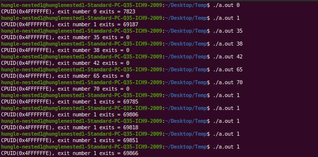

# Instrumentation_via_Hypercall

> Modify the processor instruction behavior inside KVM hypervisor

## Table of contents
* [Prerequisites](#prerequisites)
* [Answers](#answers)
* [Output](#output)
* [Technologies](#technologies)
* [Contributors](#contributors)
* [References](#references)

## Prerequisites

A working KVM modification environment. Setup can be found following the installation manual at [this link](https://github.com/eccx400/Virtualization-Technologies/tree/master/KVM_Modification).


## Output



## Answers

1. I worked on the project with [Hung Le](https://github.com/HungVLe). I focused on researching how the project should be implemented, dependency files, answering the questions, and preparing the documentation of the project.Hung focused on writing the code and making sure the implementation was correct, and that the test code showed the output.

2. For this project, I built on the framework of the VM infrastructure in [Assignment 2](https://github.com/eccx400/Virtualization-Technologies/tree/master/KVM_Modification). To start with configuration, I first cloned the Github Repository for the Linux Kernel [here](https://github.com/torvalds/linux). After cloning to the local machine, I needed to set up the kernel by running the following commands:

    ```
    sudo bash
    apt-get install build-essential kernel-package fakeroot libncurses5-dev libssl-dev ccache bison flex libelf-devuname -a
    cp /boot/config-4.15.0-112-generic ./.config
    make oldconfig
    make && make modules && make install && make modules-install
    reboot
    ```
    and then wait for a few hours for everything to compile. Check correct kernel installed with `uname -a` for newest version (5.8+).
    
    ```
    Linux eccx400-VirtualBox 5.9.0-custom #1 SMP Mon Nov 2 12:13:27 PST 2020 x86_64 x86_64 x86_64 GNU/Linux
    ```
    
    Find the files in the linux module that need changing. Access the directory in /linux/arch/x86/kvm to find cpuid.c and /linux/arch/x86/kvm/vmx to find vmx.c, which are the two main files that we need to complete this project. In cpuid.c, we will need to change the <b>kvm_emulate_cpuid</b> function mentioned in lecture 5 for managing the specific CPUID leaf function %eax=0x4FFFFFFE. 
    
    To run the program, we need to create an inner VM from which we can check for exits. We install virt-manager and other dependent files using `sudo apt install qemu-kvm libvirt-clients libvirt-daemon-system bridge-utils virt-manager` and then changing the <b>/etc/network/interfaces</b> file to create a connection. More instructions can be followed in the [references](#references) section below. After opening up the inner VM and making sure it works, we can continue our assignment.
    
    With the inner VM set up, we can then use it to find the number of exits using nested paging. After changing the cpuid.c and vmx files, the make installation code from above is called again, and the test code is compiled using gcc and executed.
    
3. From the output during execution, we found that the number of exits increase at a relatively stable rate, at around 100-200 exits. Some VM Exits are more common than others, with exits from Exception NMI, External Interrupt being much higher than others exit types such as VMREAD, MOV DR, Triple Fault, etc. If an exit does not exist, then the output would be 0.

4. The most frequent exit types are the standard ones used during OS bootup and entry into the nested VM, such as HLT, External Interrupt, Exception NMI, EPT misconfiguration & violation, etc. The least frequent types included VMCLEAR, VMOV DR, Triple Fault, etc.

## Technologies
* Ubuntu on Oracle Virtualbox

## Contributors

| Contributors | GitHub Link                 |
|--------------|-----------------------------|
| Eric Cheng   | https://github.com/eccx400/ |
| Hung Le      | https://github.com/HungVLe  |

## References

Here are some links for installing the Inner VM using Virtual Machine Manager which I followed:
* https://help.ubuntu.com/community/KVM/VirtManager
* https://linuxconfig.org/install-and-set-up-kvm-on-ubuntu-20-04-focal-fossa-linux
