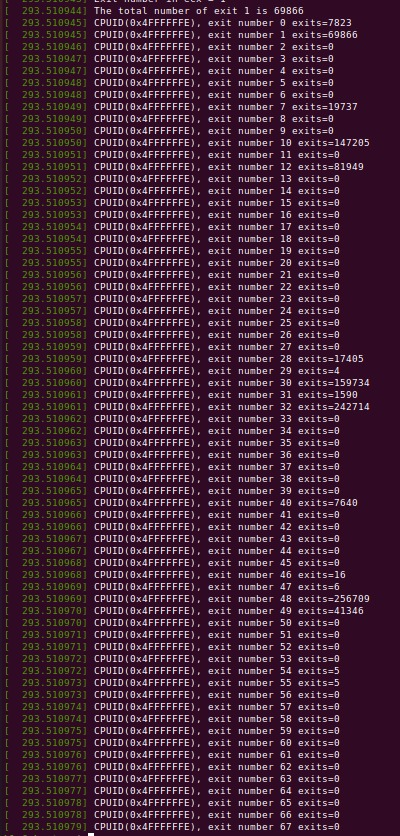
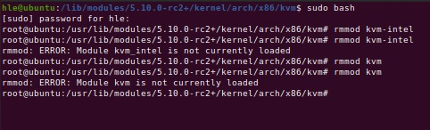
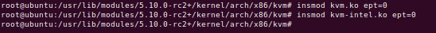
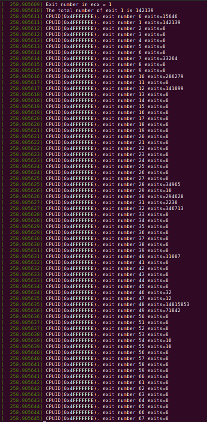

# Shadow_Paging

> Compare performance between nested paging (EPT) and shadow paging (non-EPT) inside KVM hypervisor

## Table of contents
* [Prerequisites](#prerequisites)
* [Answers](#answers)
* [Output](#output)
* [Technologies](#technologies)
* [Contributors](#contributors)

## Prerequisites

A working KVM modification environment with nested paging. Setup can be found following the installation manual at [this link](https://github.com/eccx400/Virtualization-Technologies/tree/master/3_Instrumentation_via_Hypercall).


## Output

```
Output: CPUID(0x4FFFFFFF), exits= 454923, cycles spent in exit= 143924831
```

## Answers

1. I worked on the project with [Hung Le](https://github.com/HungVLe). I focused on researching how the project should be implemented, dependency files, answering the questions, and preparing the documentation of the project. Hung focused on setting up the Virtual Machine and the inner VM, updating the cpuid.c and vmx.c modules, making sure the implementation was correct and produced the right output.

2. Implementation steps:
- Before remove modules (Nested Paging), total count for each type of exit handled by KVM



- Remove kvm and kvm-intel modules



- Insert kvm and kvm-intl modules with ept=0



- After reload modules (Shadow Paging), total count for each type of exit handled by KVM


    
3. When running the Virtual Machine with Extended Page Tables turned off, we can clearly see that the number of exits increased.

4. The differences between running Nested Paging (EPT) vs Shadow Paging(non-EPT) were...

## Technologies
* Ubuntu on Oracle Virtualbox

## Contributors

| Contributors | GitHub Link                 |
|--------------|-----------------------------|
| Eric Cheng   | https://github.com/eccx400/ |
| Hung Le      | https://github.com/HungVLe  |
